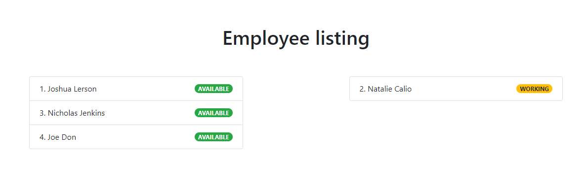
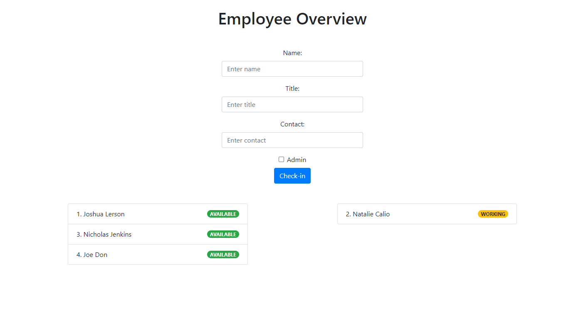

# Snow Removal Management

## Description 
This is a full-stack web application that allows managers and employees of a snow removal company to do their jobs more efficiently. For managers, it presents a comprehensive dashboard displaying crews and jobs. For employees, it displays infomation on crews and estimated completion times. Login-based authentication has also been integrated in this application. The front-end is built using Bootstrap (and Handlebars). The back-end consists of Express and MySQL (using Sequelize ORM). For authentication middleware, the Passport module was used with local strategy.

## Table of Contents (Optional)

* [Usage](#usage)
* [Technologies Used](#technologies used)
* [Screenshot](#screenshot)
* [Credits](#credits)
* [License](#license)
* [Authors](#authors)

## Usage 
The application can be installed using the following:

git clone https://github.com/omair-muhi/snow-removal-mgmt.git

## Technologies Used
- Javascript
- HTML/CSS
- MySQL
- Bootstrap
- Express
- Express-handlebars
- Express-session
- Node-fetch
- Nodemon
- Passport
- Node
- MapBox API
- Heroku

### Dev Environment
1. `npm install`
2. `source schema.sql`
3. `npm run start`
4. `npx sequelize-cli db:seed:all`

## Screenshot

## Authors
Omair Muhi
Mike Tkachuk
Pieter Boerma

## Credits
* UoT FSF Bcamp - this template

## Access at
Heroku Deploy
https://snowmanagement.herokuapp.com/

Github Repo
https://github.com/omair-muhi/snow-removal-mgmt

## License

MIT License

---
© 2019 Trilogy Education Services, a 2U, Inc. brand. All Rights Reserved.
